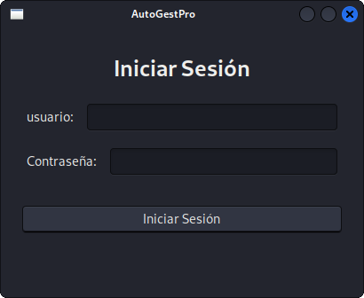
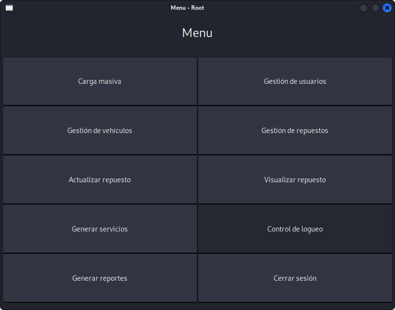
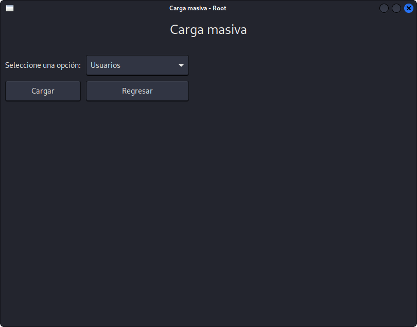
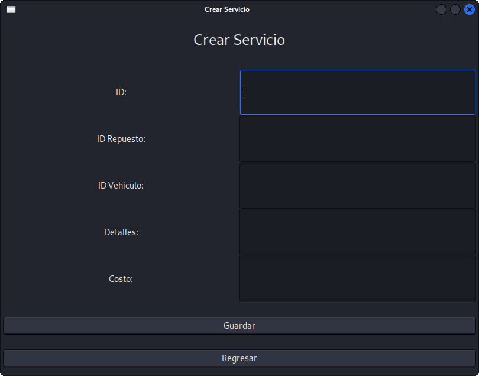
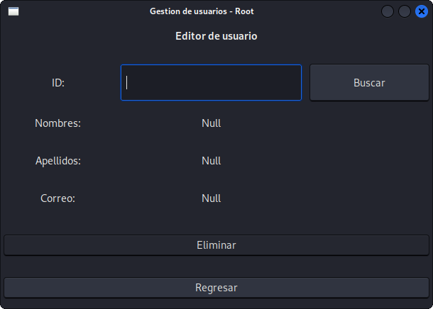
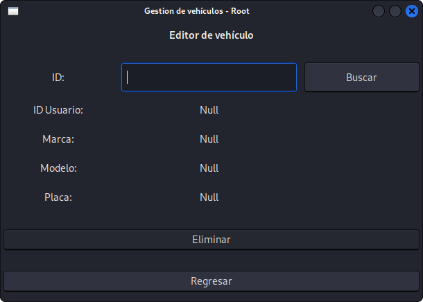
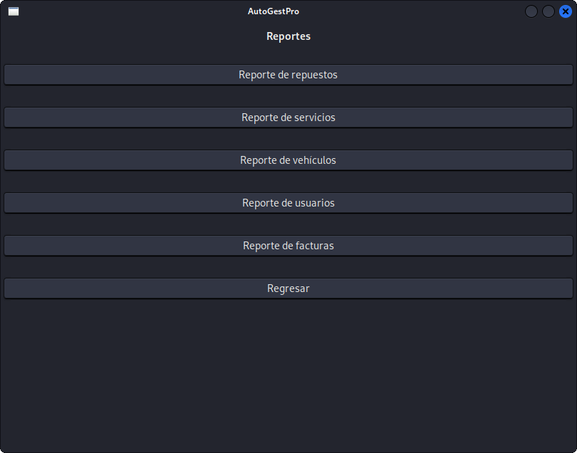
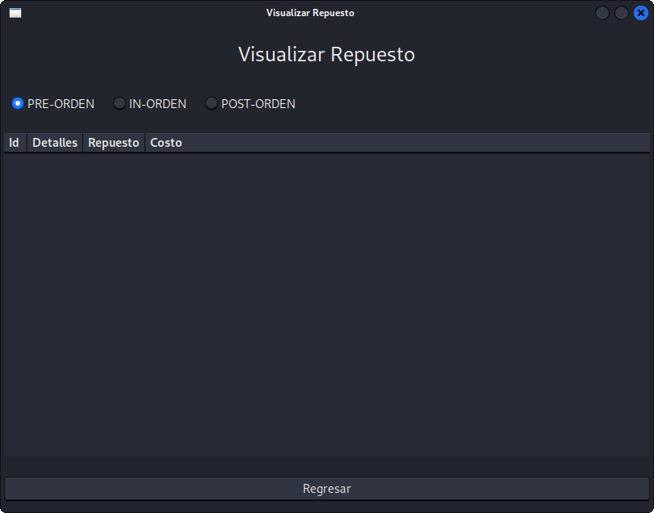
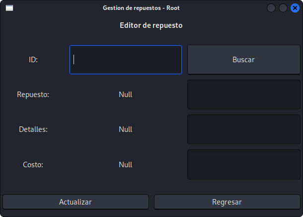
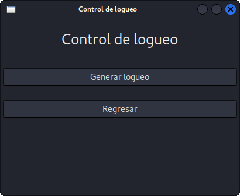

# Manual de Usuario

- Autor: José Emanuel Monzón Lémus
- Carnet: 202300539
- Curso: Estructuras de datos
- Repositorio: https://github.com/0520Jose/-EDD-Proyecto_202300539.git

## Introducción

El presente manual fue creado con la función de mostrar el funcionamiento y uso correcto del proyecto AutoGestPro desarrollado para el curso de Estructuras de Datos. En el presente se muestran todas las funcionalidades a las cuales podrá acceder el usuario. Este programa cuenta con la función de administrar los registros de un taller mecánico.

## Objetivos
### General
+ Presentar y explicar de manera detallada el funcionamiento y funcionalidades con la que cuenta el proyecto AutoGestPro.

### Específicos
+ Mostrar el correcto funcionamiento de AutoGestPro.
+ Mostrar las funcionalidades y los resultados que serán obtenidos según sean los archivos o textos de entrada.

## Funcionalidades

### Es una ventana generada Inicio de Sesión
En esta Es una ventana generada el usuario podrá iniciar sesión si ha ingresado credenciales válidas y existentes.

---

### Menú Principal
En esta Es una ventana generada se encuentran todas las opciones de las acciones que puede realizar el usuario.

---

### Carga Masiva
Es una ventana generada para cargar archivos al programa, donde se puede seleccionar el tipo de archivo a cargar.

---

### Crear Servicio
Es una ventana generada para la creación de servicios de manera manual.

---

### Editar Usuario
Es una ventana generada para modificar los datos de un usuario existente.

---

### Editar Vehículo
Es una ventana generada para modificar los datos de un vehículo existente.

---

### Generar Reportes
Es una ventana generada para generar reportes de usuarios, repuestos, vehículos, servicios, facturas y bitácoras.

---

### Visualizar Repuesto
Es una ventana generada para visualizar los detalles de un repuesto registrado.

---

### Actualizar Repuesto
Es una ventana generada para actualizar la información de un repuesto existente.

---

### Control de Logueo
Es una ventana generada para gestionar el control de inicio y cierre de sesión de los usuarios.

---
