# Manual de Usuario

- Autor: José Emanuel Monzón Lémus
- Carnet: 202300539
- Curso: Estructuras de datos
- Repositorio: https://github.com/0520Jose/-EDD-Proyecto_202300539.git

## Introducción

El presente manual fue creado con la función de mostrar el funcionamiento y uso correcto del proyecto AutoGestPro desarrollado para el curso de Estructuras de Datos. En el presente se muestran todas las funcionalidades a las cuales podrá acceder el usuario. Este programa cuenta con la función de administrar los registros de un taller mecánico, además de la realización de backups para la persistencia de datos dentro de la misma.

## Objetivos
### General
+ Presentar y explicar de manera detallada el funcionamiento y funcionalidades con la que cuenta el proyecto AutoGestPro.

### Específicos
+ Mostrar el correcto funcionamiento de AutoGestPro.
+ Mostrar las funcionalidades y los resultados que serán obtenidos según sean los archivos o textos de entrada.

## Funcionalidades - ROOT

### Inicio de Sesión
Es una ventana en la cual el usuario podrá iniciar sesión si ha ingresado credenciales válidas y existentes correspondientes a un usuario dentro del sistema.

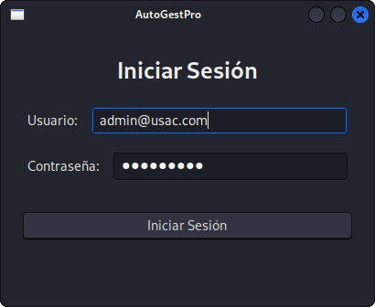

---

### Menú Principal
Es una ventana tipo menu donde se encuentran todas las opciones de las acciones que puede realizar el administrador como el ingreso de usuarios y verificación de los mismos entre otras accciones.

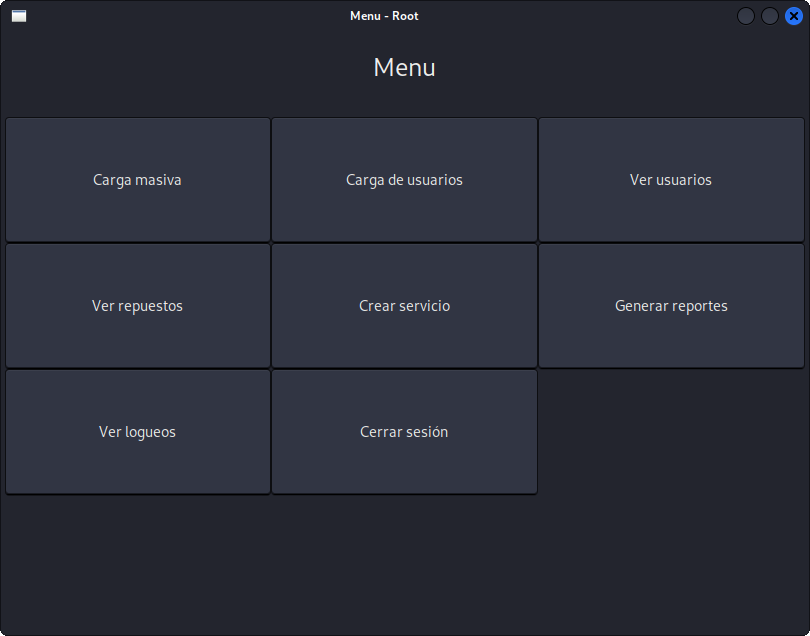

---

### Carga Masiva
Es una ventana la cual cuenta con la funcion para cargar archivos al programa, donde se puede seleccionar el tipo de archivo a cargar.

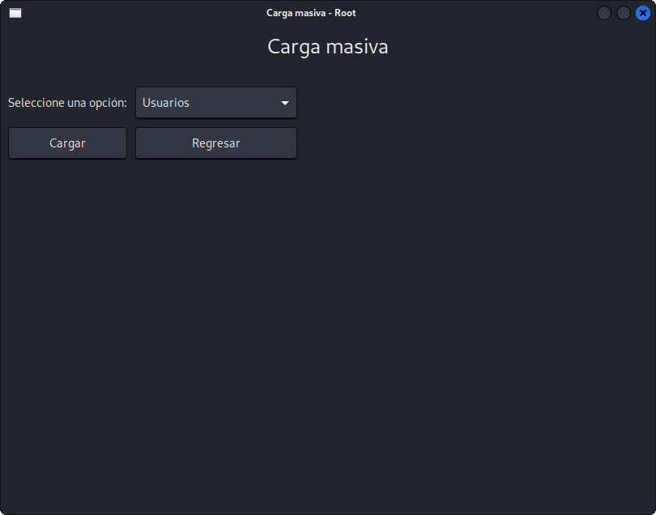

---

### Crear Usuario
Es una ventana la cual cuenta con la función para la creación de usuarios de manera manual un usuario a la vez.

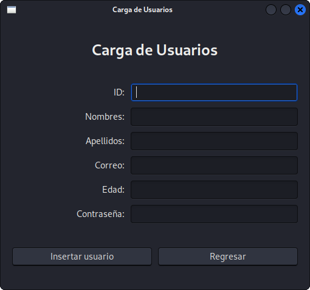

---

### Ver Usuarios
Es una ventana la cual permite la visualización de todos los usuarios que se encuentran cargados dentro del sistema.

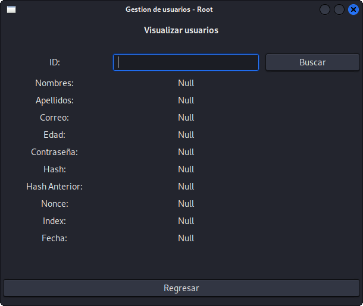

---

### Ver Vehiculos
Es una ventana la cual permite la visualización de todos los vehiculos que se encuentran cargados dentro del sistema.

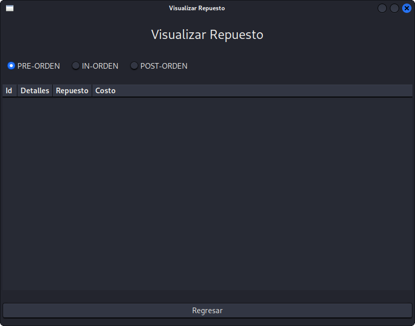

---

### Crear Servicio
Es una ventana la cual cuenta con la función  para la creación de servicios de manera manual.

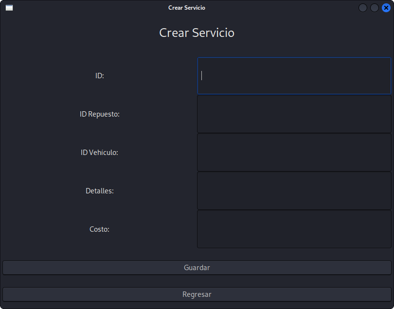

---

### Generar Reportes
Es una ventana generada para generar reportes de usuarios, repuestos, vehículos, servicios, facturas y relaciones por medio de un grafo.

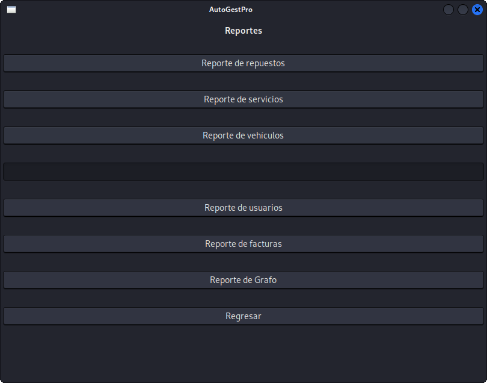

---

### Control de Logueo
Es una ventana generada para gestionar el control de inicio y cierre de sesión de los usuarios.

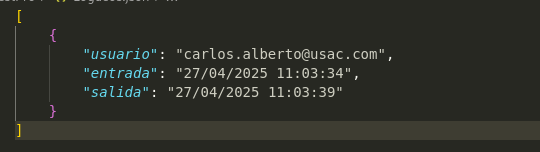

## Funcionalidades - Usuarios

### Menú de usuario

Es una ventana tipo menú en la cual es usuario puede acceder a las acciones a las que tiene acceso.

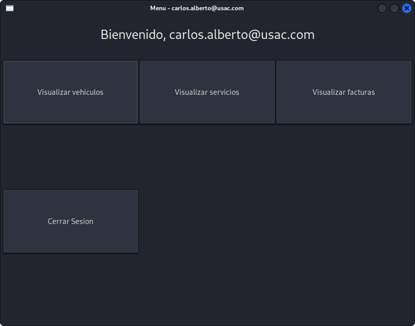

### Visualizar Vehiculo

Es una ventana en el cual el usuario podrá mostrar los vehiculos registrados al usuario actual.

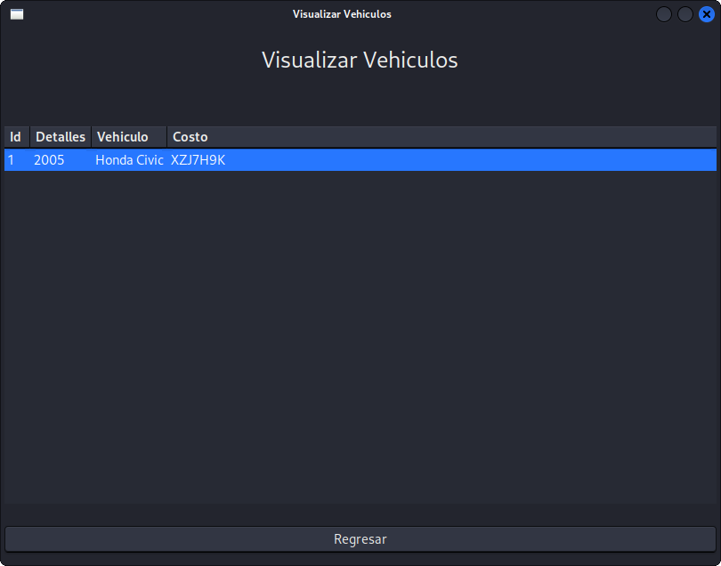

### Visualizar Servicios

En una ventana en el cual el usuario podrá visualizar los servicios los cuales le han brindado.

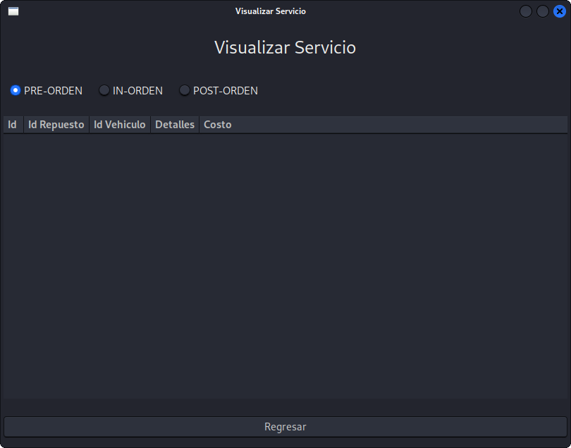

### Visualizar Facturas

En una ventana en el cual el usuario podrá visualizar las factuas correspondientes a los servicios generados para el usuario.

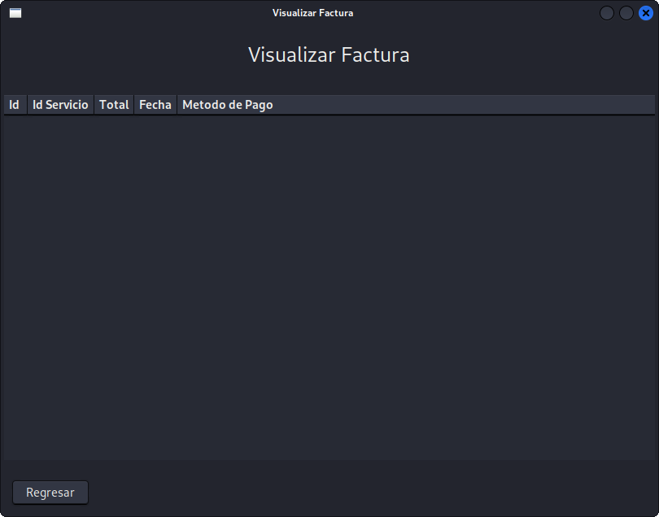